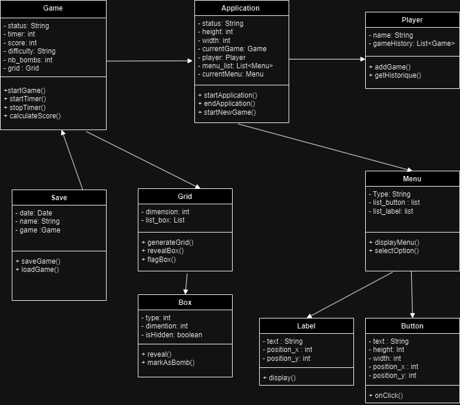

## Introduction
Ce rapport présente notre plan de travail et notre stratégie de test pour le développement d'une application Java du jeu "Démineur"  (Mine Sweeper). Notre équipe est composée de trois membres : 
- ROSTANE Mohammed Amine
- TINESTI Mohamed Reda
- JOUIMAA Salma 

## Plan de travail
### Répartition des Tâches
- **Amine (Logique du Jeu)**
    - Développer la logique principale du jeu.
    - Implémenter les algorithmes pour la génération des mines et la détection des cases vides.
    - S'assurer que la logique du jeu respecte les règles traditionnelles du démineur.
    
- **Reda (Programmation Graphique)**
    -   Mettre en place l'affichage en interface graphique (JavaFx).
    -   S'assurer de l'interaction fluide entre l'utilisateur et l'interface graphique.
    -   Collaborer avec Salma pour l'intégration du design des cases.

- **Salma (Design de l'Interface et Programmation)**
    -   Concevoir l'interface utilisateur du jeu.
    -   Travailler avec Reda pour intégrer le design dans le jeu.
    -   S'initier à la programmation en Java pour aider dans des tâches simples de codage.
 
## Plan de Tests

### Tests de Développement (Unitaires et d'Intégration)

-   **Tests Unitaires** :
    
    -   Test de chaque méthode et classe individuellement.
    -   S'assurer que chaque fonction retourne le résultat attendu dans différents scénarios.
-   **Tests d'Intégration** :
    
    -   Test de l'intégration entre les différents composants du jeu.
    -   S'assurer que les modules interagissent correctement.

### Tests d'Utilisabilité et de Performance

-   Tests avec des utilisateurs réels pour évaluer l'expérience utilisateur.
-   Tests de charge pour évaluer la performance sous différentes conditions.

### Assurance Qualité

-   Utiliser **JavaLint** pour évaluer la qualité du code avec un objectif de score supérieur à 8/10.
-   Révision régulière du code entre les membres de l'équipe pour garantir les meilleures pratiques de codage.

## Diagramme de classes UML
