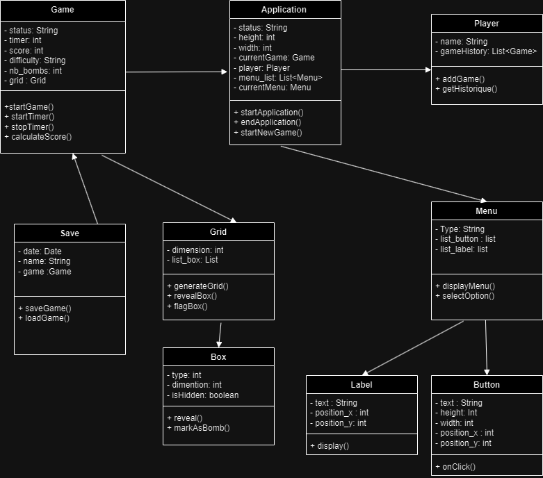

## Introduction
Ce rapport présente notre plan de travail et notre stratégie de test pour le développement d'une application Java du jeu "Démineur"  (Mine Sweeper). Notre équipe est composée de trois membres : 
- ROSTANE Mohammed Amine
- TINESTI Mohamed Reda
- JOUIMAA Salma 

## Plan de travail
### Répartition des Tâches
- **Amine (Logique du Jeu)**
    - Développer la logique principale du jeu.
    - Implémenter les algorithmes pour la génération des mines et la détection des cases vides.
    - S'assurer que la logique du jeu respecte les règles traditionnelles du démineur.
    
- **Reda (Programmation Graphique)**
    -   Mettre en place l'affichage en interface graphique (JavaFx).
    -   S'assurer de l'interaction fluide entre l'utilisateur et l'interface graphique.
    -   Collaborer avec Selma pour l'intégration du design des cases.

- **Selma (Design de l'Interface et Programmation)**
    -   Concevoir l'interface utilisateur du jeu.
    -   Travailler avec Reda pour intégrer le design dans le jeu.
    -   S'initier à la programmation en Java pour aider dans des tâches simples de codage.

## Diagramme de classes UML
