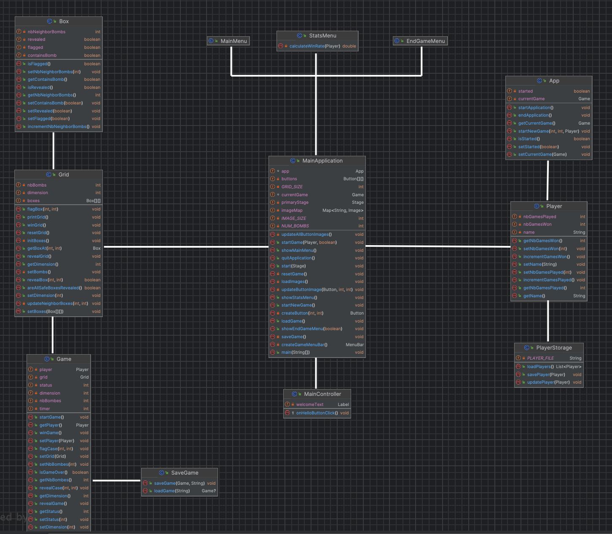

## Introduction

These are the instructions for setting up and running the Minesweeper game project. This JavaFX application requires IntelliJ IDEA with JavaFX setup. Follow the steps below to get started. The final UML for this project is provided at the end of this file.

## Prerequisites

-   IntelliJ IDEA
-   JavaFX SDK
-   Maven (Integrated with IntelliJ IDEA)

## Setup Instructions

### Step 1: Prepare Your IntelliJ Project

1.  **Create a New JavaFX Project**: Open IntelliJ IDEA and create a new JavaFX project. Choose an appropriate name for your project, such as `com.example.minesweeper`.
    
2.  **Clone the Repository**: Clone or download the source code from the given repository.
    
3.  **Replace the `src` Folder**: Copy the `src` folder from the cloned repository and replace the `src` folder in your IntelliJ JavaFX project.
    

### Step 2: Configure Jackson Library

You will need to download Jackson Databind library (version 2.16.1) and add it to your project.

1.  **Download Jackson Databind JAR**: Download the Jackson Databind library JAR files (version 2.16.1) from a trusted source.
    
2.  **Add Jackson as a Library**:
    
    -   In IntelliJ, go to `File` -> `Project Structure`.
    -   Under `Libraries`, click the `+` sign to add a new library.
    -   Browse and select the downloaded Jackson Databind JAR files.
    -   Click `OK` to add them to your project.

### Step 3: Update Maven Dependencies

Add the following dependency to your `pom.xml` file for Maven:

```xml
<dependency>
    <groupId>com.fasterxml.jackson.core</groupId>
    <artifactId>jackson-databind</artifactId>
    <version>2.16.1</version>
</dependency>
```

### Step 4: Running the Application

1.  **Open the MainApplication Class**: Navigate to the `MainApplication.java` file in the `src` folder.
    
2.  **Run the Application**: Right-click on the `MainApplication.java` file and select `Run 'MainApplication'` to start the application.

## Final UML

